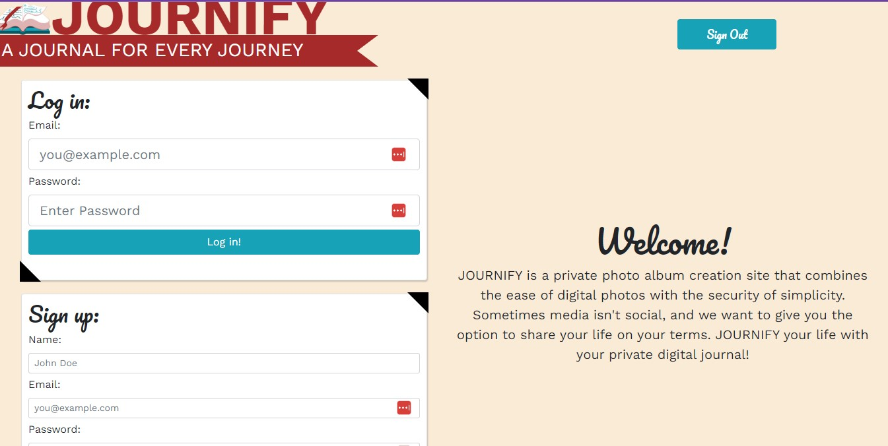
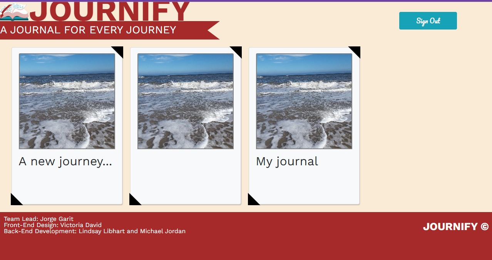
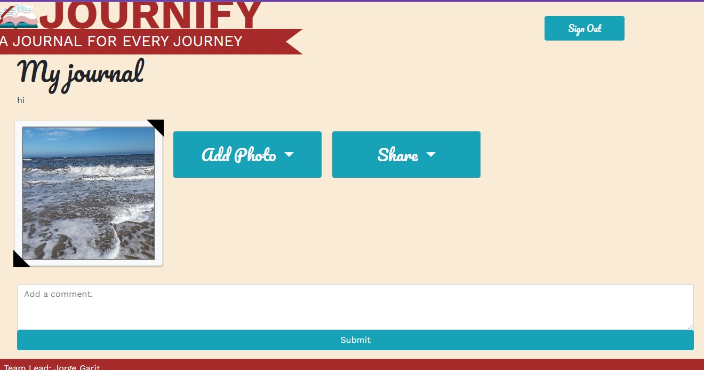

# Ice-Blazers Journify, Photo Sharing App
## Group Project, Challenge 15 - UCF Coding Boot Camp

## Table of Contents:
* [General Information](#general)
* [Deployed Website](#website)
* [Technologies](#technologies)
* [Credits](#credits)
* [Screenshots](#screenshots)
* [License](#license)
* [Footer](#footer)

### General Information:
This application is a photo journaling application. A user will have the ability to upload groups of photos to designated files in order to journal important moments in their lives.The user will also be able to tag locations to their photo albums. The user will be given a specific id that they can share with family and friends for them to view. The user and their friends/families can also interact with each other's journals posting comments, likes, etc. 

### Deployed Website:
Please visit the following Heroku link to open the application: https://salty-forest-28898.herokuapp.com/login

### Technologies:
JavaScript, Express NodeJS, NPM packages: express, dotenv, mysql2, multer and cors, HTML and CSS.

### Credits:
* Multer middleware: https://expressjs.com/en/resources/middleware/multer.html
* Cors middleware: https://expressjs.com/en/resources/middleware/cors.html

### Screenshots 

#### Login Page

#### Home Page

#### My Journal Page

#### Create Journal Page

### License
This project is licensed under:
License for this project is MIT

#### Footer:
This project was developed by:

Victoria David
rebeldraconis@gmail.com
GitHub Repository: https://github.com/xunvyre

Jorge Garit (Lead)
jorgegarit@gmail.com
GitHub Repository: https://github.com/jorgegarit

Michael Jordan
Mojosox@gmail.com
GitHub Repository: https://github.com/mike-jordan79

Lindsay L Libhart
Libhartinc@gmail.com
GitHub Repository: https://github.com/LibhartLL

This projects GitHub Repository is:
https://github.com/jorgegarit/ice-blazers

